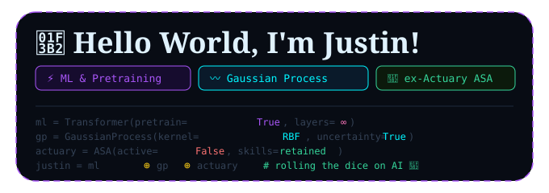

## 🌟 **Let's Connect!**

I'm always open to collaborating on interesting projects or discussing new ideas. Feel free to reach out to me!

## 📖 Education

**Ph.D. in Statistics, Rice University (2025 – Present)**

**M.S. in Statistical Science, Duke University (2023 – 2025)**

**Economics & Actuarial Science, The University of Texas at Austin**

## 📖 About Me

🎓 I'm a PhD student at the **Department of Statistics, George R. Brown School of Engineering and Computing, Rice University**.

🔬 My research focuses on advancing methodologies in machine learning, graphical models, Bayesian semi/nonparametric modeling, Gaussian processes, hierarchical modeling, MCMC, time series analysis, and stochastic processes. I develop statistical and machine learning applications to address complex, impactful challenges across social networks, public health, economics, finance, actuarial science, and beyond.

📈 Currently, I work with **Dr. Meng Li** on _Hierarchical Bayes Optimal Posterior Contraction for Gaussian Process Derivative Functionals_.

🔒 Previously, I worked with **Dr. Jerry Reiter** at Duke University on _Bayesian and frequentist intervals under differential privacy for binomial proportions_.

---

## 🛠️ **Technologies & Tools**

---

## Professional License

**Society of Actuaries (SOA)** — Schaumburg, IL  
**Associate of the Society of Actuaries (ASA), ID: 927968**  
_April 2024 – Present_

- Exam PA: Predictive Analytics — Apr 2023
- Exam FAM-S: Fundamentals of Actuarial Mathematics – Short-Term — Mar 2023
- Exam LTAM: Long-Term Actuarial Mathematics — Apr 2022
- Exam IFM: Investment & Financial Markets — Jul 2022
- VEE Economics — Aug 2021
- VEE Mathematical Statistics — Aug 2021
- Exam SRM: Statistics for Risk Modeling — Aug 2021
- Exam FM: Financial Mathematics — Feb 2021
- Exam P: Probability — May 2020

---

## 🛠️ Skills

- **Languages:** Python, R, JavaScript, CSS, HTML, Git

<!-- 
---

 ## 🔗 Links

- 🌐 Website: [jkstatai.github.io](https://jkstatai.github.io)
- 💼 LinkedIn: [linkedin.com/in/justin-kao-asa](https://www.linkedin.com/in/justin-kao-asa-9248ba16a/)
